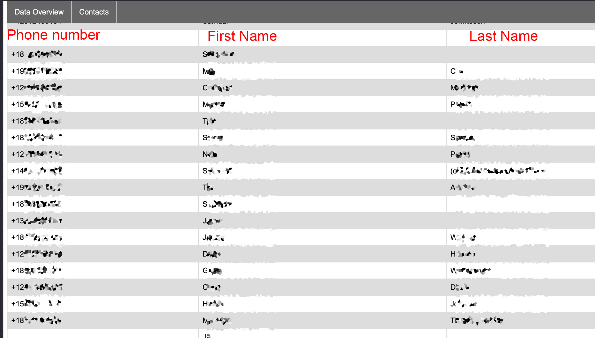

# Hackwest iOS forensics



### Installation
```bash
pip install -r requirements.txt
```

### Usage
This project requires that you have an encrypted iOS backup. 
You first need to run the program with the `--find-mimes`  flag 
with an argument to the root directory of your backup
```bash
python ios_backup_browser.py --find-mimes /path/to/ios/backup 
```
This will then build a `ios_data.db` database in your home directory 

