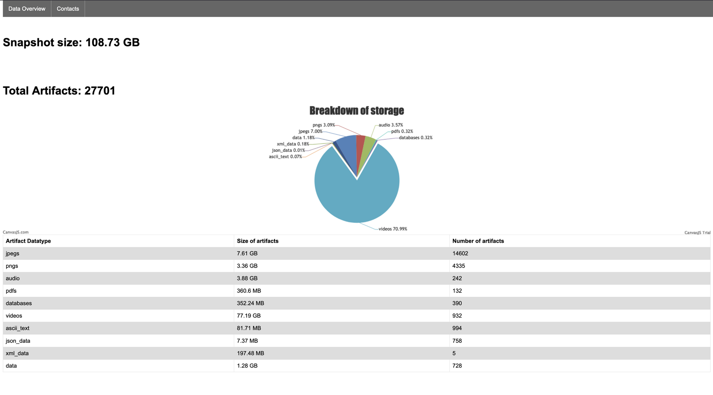

# iOS Backup Browser 
Export your contacts & media form iOS backups 

This project was submitted to [HackWest 2022](https://devpost.com/software/ios-backup-browser) 


### Installation
```bash
pip install -r requirements.txt
```

### Usage
```bash
python ios_backup_browser.py --help
```
```
usage: ios_backup_browser.py [-h] [-fm FIND_MIMES] [-dr] [-fc] [-em EXPORT_MEDIA]

iOS forensic tool

optional arguments:
  -h, --help            show this help message and exit
  -fm FIND_MIMES, --find-mimes FIND_MIMES
                        pass it a directory of ios extraction
  -dr, --data-report    generate html showing stuff
  -fc, --find-contacts  Print data of current DB
  -em EXPORT_MEDIA, --export-media EXPORT_MEDIA
                        Save media from backup to specified directory
```

This project requires that you have an unencrypted iOS backup. 
You first need to run the program with the `--find-mimes`  flag 
with an argument to the root directory of your backup
```bash
python ios_backup_browser.py --find-mimes [/path/to/ios/backup]
```
This will then build a `ios_data.db` database in your home directory 

**`--data-report`**

This flag produce an html file that displays how many 
artifacts of each datatype were found along with 
some disk usage information.
```bash
python ios_backup_browser.py --data-report
```

**`--find-contacts`**

Makes a csv file with your contacts
```bash
python ios_backup_browser.py --find-report
```

**`--export-media [output directory]`**

Copies all JPEG images found in snapshot to directory
provided by argument.
```bash
python ios_backup_browser.py --export-media [path/to/output/directory]
```
